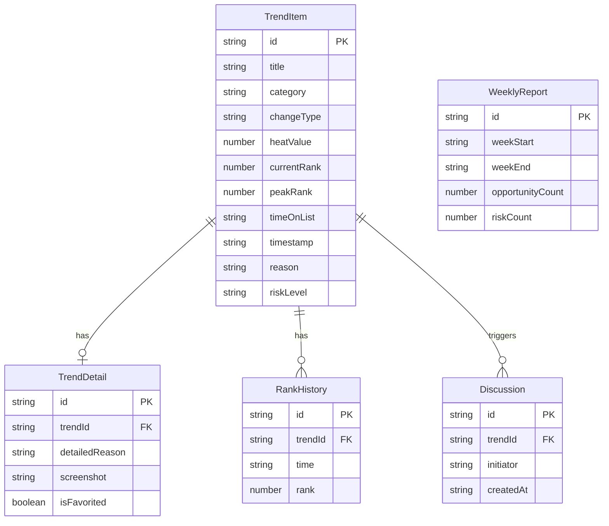

## 1. 架构设计

```mermaid
flowchart TB
    "前端 React App" --> "Zustand 状态管理"
    "Zustand 状态管理" --> "Mock 数据层"
    "Mock 数据层" --> "热搜异动数据"
    "Mock 数据层" --> "用户与讨论数据"
    "Mock 数据层" --> "周报汇总数据"
    "前端 React App" --> "React Router 路由"
```

本项目为纯前端应用，使用 Mock 数据模拟后端接口，便于快速原型验证。

## 2. 技术说明

- **前端**：React@18 + TypeScript + Tailwind CSS@3 + Vite
- **初始化工具**：vite-init
- **后端**：无（纯前端，Mock 数据）
- **数据库**：无（使用内存状态 + Mock JSON）
- **状态管理**：Zustand
- **图表库**：Recharts（用于排名曲线图）
- **图标库**：lucide-react

## 3. 路由定义

| 路由 | 用途 |
|------|------|
| `/` | 首页：热搜异动卡片流与视角切换 |
| `/detail/:id` | 详情页：异动详情、收藏与发起讨论 |
| `/weekly` | 周报页：一周热搜机会与风险排序 |

底部 Tab 导航对应三个主页面，使用 React Router 的 Bottom Navigation 模式。

## 4. API 定义（Mock）

### 4.1 获取异动列表

```typescript
interface TrendItem {
  id: string
  title: string
  category: 'brand' | 'competitor' | 'spokesperson' | 'industry'
  changeType: 'rising' | 'falling' | 'fluctuating' | 'new_entry'
  heatValue: number
  currentRank: number
  peakRank: number
  timeOnList: string
  timestamp: string
  reason: string
  tags: string[]
  riskLevel: 'opportunity' | 'warning' | 'danger'
}

function getTrendList(category: string): TrendItem[]
```

### 4.2 获取异动详情

```typescript
interface TrendDetail extends TrendItem {
  rankHistory: { time: string; rank: number }[]
  screenshot: string
  relatedWords: string[]
  detailedReason: string
  isFavorited: boolean
}

function getTrendDetail(id: string): TrendDetail
```

### 4.3 发起讨论

```typescript
interface Discussion {
  id: string
  trendId: string
  initiator: string
  participants: string[]
  screenshot: string
  rankChart: string
  initialJudgment: string
  createdAt: string
}

function createDiscussion(trendId: string, participants: string[]): Discussion
```

### 4.4 获取周报

```typescript
interface WeeklyReport {
  weekStart: string
  weekEnd: string
  opportunityCount: number
  riskCount: number
  opportunityChange: number
  riskChange: number
  opportunities: {
    id: string
    title: string
    impactLevel: number
    suggestedAction: string
  }[]
  risks: {
    id: string
    title: string
    impactLevel: number
    warningLevel: 'low' | 'medium' | 'high'
  }[]
  timeline: {
    time: string
    event: string
    type: 'opportunity' | 'risk'
  }[]
}

function getWeeklyReport(): WeeklyReport
```

## 5. 服务器架构图

不适用，本项目为纯前端应用。

## 6. 数据模型

### 6.1 数据模型定义



### 6.2 数据定义语言

本项目使用 Mock 数据，数据结构以 TypeScript 接口定义，无需 DDL。
